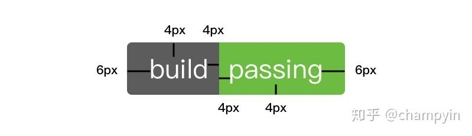
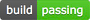

# GitHub项目徽标 - 知乎

## 代码直接复制

```html
1. 新建一个
<div align="center"><.div>

<!-->个人信息</-->
    <a href ="https://dancehole.gitee.io/"></a>
    <a href ="https://gitee.com/dancehole"></a>
    <a href ="https://github.com/dancehole"></a>

<!-->license</-->
<!-->MIT</-->
    <a href ="https://en.wikipedia.org/wiki/MIT_License"></a>
<!-->apache2</-->
    <a href ="https://www.apache.org/licenses/LICENSE-2.0.html"></a>

<!-->仓库类型</-->
	<a></a>
    
    
<!-->仓库状态</-->
	<!-->更新中</-->
    <a></a>
    <!-->已完成</-->
    <a></a>
    <!-->已停止更新</-->
    <a></a>
    <!-->不可用</-->
	<a></a>
    
    
<!-->下载</-->
    <!-->可用</-->
<div align="center">
    <a href="地址"></a>
    <!-->不可用</-->
    <a></a>
</div>
    
    
<!-->发行版（后面改为动态徽标）</-->
    <!-->可用</-->
    <div align="center">
        <a href="地址"></a>
    <!-->不可用</-->
    <a></a>
</div>
```

## 我的徽标

<div align="center">
    <a href ="https://dancehole.gitee.io/"></a>
    <a href ="https://gitee.com/dancehole"></a>
    <a href ="https://github.com/dancehole"></a>
</div>

<div align="center">
    <a href ="https://www.apache.org/licenses/LICENSE-2.0.html"></a>
    <a></a>
    <a></a>
    <a></a>
    <a></a>
</div>


---

<div align="center">
    <a></a>
<a></a>
</div>

----

<div align="center">
    <a></a>
    <a></a>
    <a></a>
	<a></a>
</div>

---

<div align="center">
    <a></a>
    <a></a>
</div>

---

<div align="center">
        <a></a>
    <a></a>
</div>

---

### 静态徽标

React me on / you can see me on /contact me on:


[Apache License, Version 2.0](https://www.apache.org/licenses/LICENSE-2.0.html)

[MIT License - Wikipedia](https://en.wikipedia.org/wiki/MIT_License)

[个人博客https://dancehole.gitee.io](https://dancehole.gitee.io/)

[dancehole (dancehole) - Gitee.com](https://gitee.com/dancehole)

[dancehole (dancehole) (github.com)](https://github.com/dancehole)


超链接图片的两种方法： 

```
<a href ="超链接地址"></a>
 [](超链接地址)
```

[](https://www.apache.org/licenses/LICENSE-2.0.html)

想要居中只能用第一种办法:

<a href ="https://en.wikipedia.org/wiki/MIT_License"></a>


总结：

<div align="center">
    <a href ="https://en.wikipedia.org/wiki/MIT_License"></a>
    <a href ="https://www.apache.org/licenses/LICENSE-2.0.html"></a>
</div>


前言
--

GitHub徽标，GitHub Badge，你也可以叫它徽章。就是在项目README中经常看到的那些表明构建状态或者版本等信息的小图标。就像这样：


这些好看的小图标不仅简洁美观，而且包含了清晰易读的信息，在README中使用小徽标能够为自己的项目说明增色不少！如何给自己的项目加上小徽标呢？

一、关于徽标
------

1.  徽标图片分左右两部分，左边是标题，右边是内容，就像是键值对。
2.  GitHub徽标官网是 [https://shields.io/](https://link.zhihu.com/?target=https%3A//shields.io/)
3.  图标规范



二、如何添加动态徽标
----------

动态徽标是指如果项目状态发生变化，会自动更新状态的徽标，它能保证用户看到的信息就是项目当前的真实状态。

**常用的动态徽标有：**

*   持续集成状态
*   项目版本信息
*   代码测试覆盖率
*   项目下载量
*   贡献者统计等等

这里以\`Travis CI\` 的持续集成状态为例。没有接触过 \`Travis CI\`的可以看我的上一篇文章 [利用Travis CI+GitHub实现持续集成和自动部署](https://link.zhihu.com/?target=https%3A//champyin.com/2019/09/27/%25E5%2588%25A9%25E7%2594%25A8Travis-CI-GitHub%25E5%25AE%259E%25E7%258E%25B0%25E6%258C%2581%25E7%25BB%25AD%25E9%259B%2586%25E6%2588%2590%25E5%2592%258C%25E8%2587%25AA%25E5%258A%25A8%25E9%2583%25A8%25E7%25BD%25B2/)。

1\. 登录 \`Travis CI\`，进入配置过构建的项目，在项目名称的右边有个 \`build passing\` 或者 \`build failing\` 徽标。

2\. 点击它，在弹出框中，就可以看到 \`Travis CI\` 为你提供的各种格式的徽章地址了。

3\. 你可以根据需要选择格式，imageUrl格式大概是这个样子：

```
https://www.travis-ci.org/{your-name}/{your-repo-name}.svg?branch=master
```


markdown格式大概是这个样子：

```
[]
(https://www.travis-ci.org/{your-name}/{your-repo-name})
```


4\. 简单起见，我选择 \`markdown\` 格式。将内容复制后，打开项目的README文档，在顶部位置粘贴。

5\. 经过前4步，小徽章就搞定了。将README文档push到远程，刷新GitHub页面，过一会，就会看到README上面已经有了持续集成状态图标了:



之所以要过一会才加载出来，是因为它要动态从 \`Travis CI\` 平台获取状态。

三、如何自定义徽标
---------

[https://shields.io/](https://link.zhihu.com/?target=https%3A//shields.io/) 提供了自定义徽标的功能。

**徽标图标格式**

```
https://img.shields.io/badge/{徽标标题}-{徽标内容}-{徽标颜色}.svg
```


**带链接的徽标**

```
[]({linkUrl})
```


**变量说明**

*   徽标标题：徽标左边的文字
*   徽标内容：徽标右边的文字
*   徽标颜色：徽标右边的背景颜色，可以是颜色的16进制值，也可以是颜色英文。支持的颜色英文如下：


变量之间用 \`-\` 连接。将这3个变量替换为你需要的内容即可生成一个自定义的徽标。

**举个栗子**

例如下面这个是我的博客的徽标：

```
[](https://champyin.com)
```


效果：


点击该徽标会打开对应的linkUrl地址，即直接跳到我的博客。

> _PS：知乎不支持图片链接，所以没法看到效果，在其他支持md解析的地方是可以的_

**进阶**

除了上面所说的3个参数，[http://shields.io](https://link.zhihu.com/?target=http%3A//shields.io/) 还提供了一些 \`query string\` 来控制徽标样式。使用方式跟URL的query string一致：徽标图标地址?{参数名}={参数值}，多个参数用 \`&\` 连接：

```
https://img.shields.io/badge/{徽标标题}-{徽标内容}-{徽标颜色}.svg?{参数名1}={参数值1}&{参数名2}={参数值2}
```


常用的 \`query string\` 参数有：

*   style：控制徽标主题样式，style的值可以是：\`plastic\` | \`flat\` | \`flat-square\` | \`social\` 。
*   label：用来强制覆盖原有徽标的标题文字。
*   colorA：控制左半部分背景颜色，只能用16进制颜色值作为参数，不能使用颜色英文。
*   colorB：控制右半部分背景颜色。

**以style参数为例**

\`plastic\` 立体效果：


```

```


\`flat\` 扁平化效果，也是默认效果：


```

```


\`flat-square\` 扁平 + 去圆角效果：


!\[\]([https://img.shields.io/badge/blog-@champyin-success.svg?style=flat-square](https://link.zhihu.com/?target=https%3A//img.shields.io/badge/blog-%40champyin-success.svg%3Fstyle%3Dflat-square))

\`social\` 社交样式效果：


```

```


还有很多参数，用法类似。更多信息可以到 [https://shields.io/](https://link.zhihu.com/?target=https%3A//shields.io/) 查阅。

总结
--

徽标简洁又不失内容，使用简单又不失灵活。如果你的项目还没有使用过徽标，那么不妨试试给你的项目中添加一个，你会爱上它。

\--

欢迎转载，转载请注明出处：

本文同步发表于：

[GitHub项目徽标 | 掘金](https://link.zhihu.com/?target=https%3A//juejin.im/post/5d98b2666fb9a04e1c07e071)

