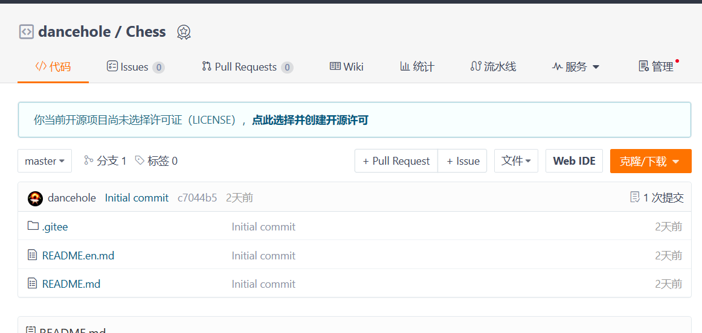
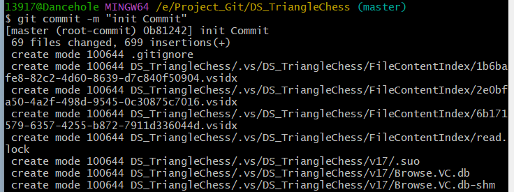
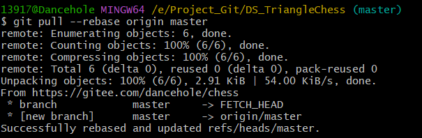

# 如何优雅的给自己的代码上云

这里只讲述必要操作

前期工作：准备一个需要上云的本地目录（建议为空，这里演示非空的情况），在远程仓库（github|gitee|gitlab|其他）上创建/准备好仓库
如图：

> 注意：远程仓库初始化后一般都非空，这里需要一些操作
>
> 假如是第一次使用Git，需要配置个人信息
>
> 在Gitbash里输入:
>
> `git config --global user.name "dancehole在git上注册的用户名"`
>
> `git config --global user.email "dancheole@email.com"`

1. 添加`.gitignore`文件，用来屏蔽一些库和不想上传的文件

1. 关联git远程仓库
   `git remote add origin https://gitee.com/xxxxxxx.git`
   使用`git remote -v`检查关联的仓库

2. 添加文件到暂存区并提交到本地版本库（否则会报错，）
   `git add .`
   使用`git stash list`查看暂存区的修改记录

4. `git commit -m "first commit"`

   

3. 如果远程仓库有文件（如readme等，需要先**拉取**程仓库）
   `git pull --rebase origin master`

   
   
4. 推送到远程仓库
   `git push origin master`

> 注意：实际操作中需要本地需要一个空仓库，不然在pull的时候会有”分支合并错误“报错

推送完成，如图：

第一次提交时，如果远程仓库有文件，需要先git pull

后续提交时流程：
在本地更新目录，准备推送(准备了2个G的文件)

1. 添加文件到暂存区并提交到本地版本库
   `git add .`
   `git commit -m "update commit "`

2. 直接提交到远程版本库

注意：提交的代码不可以太大！每个文件限制为100m/建议更小

# 意外情况的解决方案

1. 全部撤回（非常好用，谁用谁知道）

   `git reset –hard` //最万能，撤销 commit 且撤销 add

2. 清除缓存（适用于想撤回git add，或者commit时出问题，清除本地缓存变为未追踪状态）

   `git rm -r –cached .`