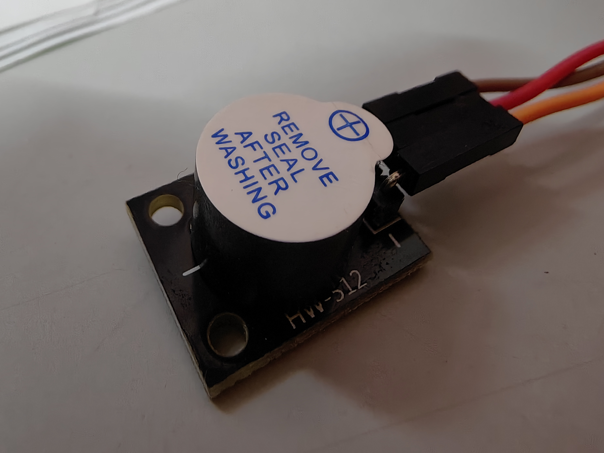
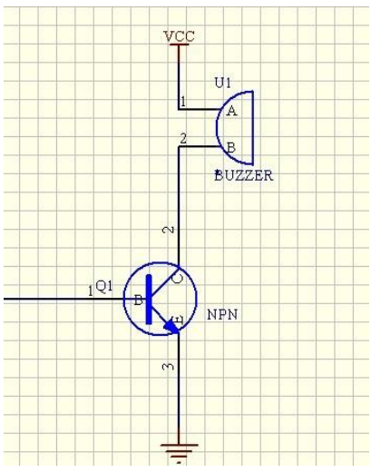
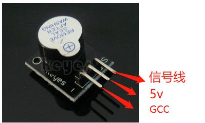
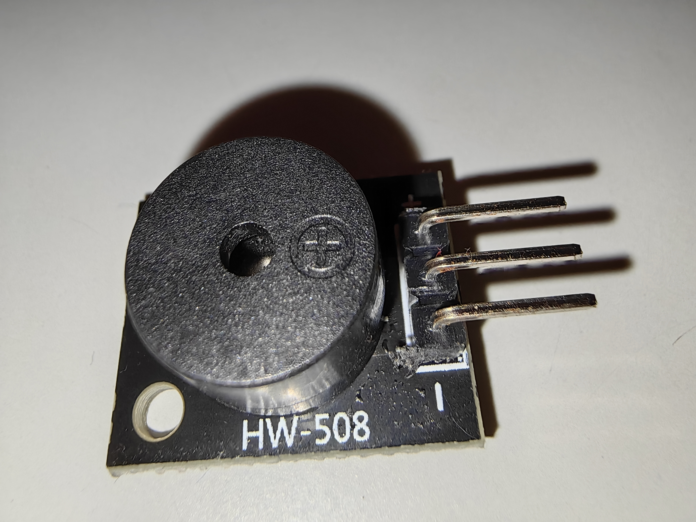
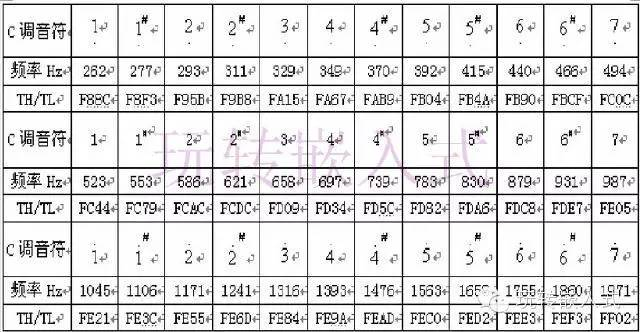

> 前言：蜂鸣器是很好玩滴东西，可以发出各种各样的声音
不过要注意接线！！


# 蜂鸣器的分类
**蜂鸣器从驱动方式上来分可以分为无源蜂鸣器和有源蜂鸣器。**

  无源蜂鸣器是没有正负之分的，类似于喇叭，只要在两个腿上加载不同的频率的电信号就可以实现发声，根据不同的频率所发出的声音也是不一样的。

  有源蜂鸣器是有正负之分的，只需要在两个腿上加上电压信号就会发声，发出的声音音调单一、频率固定。

  有源蜂鸣器比无源蜂鸣器内部多了振荡结构，所以有源蜂鸣器在价格上稍微贵一点。

**根据发声原理不同分为电压式蜂鸣器和电磁式蜂鸣器。**

 电磁式蜂鸣器：在接通电源后，振动膜片周期性的振动发声。需要注意的一点是，发声是在内部有电流产生磁场，使得膜片振动的一瞬间。 如果内部一直是直流电的话我们只能听到很小的一下的声音，如果需要持续的声音（就像我萌以前过生日的那种唱生日快乐歌的小玩意）应该怎么办呢？**需要一个交流的驱动电路就行。最简单的方波就可以驱动。** 这里我们使用的是无源蜂鸣器， 这里的源指的是振荡源，自带BUFF的就是有源，也就是直接同直流电就可以发声，无源则需要外部送入方波信号用于驱动才行。

其他分类可以参考[csdn的这篇文章](https://blog.csdn.net/weixin_42645653/article/details/111991949)

# 有源蜂鸣器（文档内容）



1. 介绍：相信大家对蜂鸣器都不会陌生，我们在很多场景下都会用到蜂鸣器，大部分都是使用蜂鸣器来做提示或报警，比如按键按下、开始工作、工作结束或是故障等等。这里对单片机在蜂鸣器驱动上的应用作一下描述。
   
2. 驱动方式
   惯用驱动蜂鸣器的方式有两种：
    一种是 PWM 输出口直接驱动，另一种是利用I/O 定时翻转电平产生驱动波形对蜂鸣器进行驱动。
   
   - PWM输出口直接驱动是利用 PWM 输出口本身可以输出一定的方波来直接驱动蜂鸣器。在单片机的软件设置中有几个系统寄存器是用来设置 PWM 口的输出的，可以设置占空比、周期等等，通过设置这些寄存器产生符合蜂鸣器要求的频率的波形之后，只要打开 PWM 输出，PWM 输出口就能输出该频率的方波，这个时候利用这个波形就可以驱动蜂鸣器了。比如频率为 2000Hz的蜂鸣器的驱动，可以知道周期为 500μs，这样只需要把 PWM 的周期设置为 500μs，占空比电平设置为 250μs，就能产生一个频率为 2000Hz 的方波，通过这个方波再利用三极管就可以去驱动这个蜂鸣器了。
   
   - 利用 I/O 定时翻转电平来产生驱动波形的方式会比较麻烦一点，必须利用定时器来做定时，通过定时翻转电平产生符合蜂鸣器要求的频率的波形，这个波形就可以用来驱动蜂鸣器了。比如为 2500Hz 的蜂鸣器的驱动，可以知道周期为 400μs，这样只需要驱动蜂鸣器的 I/O 口每 200μs 翻转一次电平就可以产生一个频率为2500Hz，占空比为 1/2duty 的方波，再通过三极管放大就可以驱动这个蜂鸣器了。
     

三、模块使用

大家看看到模块后应该明白，其实他非常方便使用，一个电源端，一个地端，还有一个就是信号输入端。我们只要把电源、地线接好，那信号线接上 IO 口就行

用两种不同的驱动方式驱动蜂鸣器的发声，大家可以比较下效果，一方便以后的使用。
具体的接法下面有:

| 模块    | 主板 |
| :-----: | ---- |
| +(边)/S | pin8 |
| +(中间) | 5v   |
| -(边)   | GCC  |

如图：



下面的这个测试代码是一个关于使用模拟量控制蜂鸣器显示频率的程序：
程序说明：第 10 引脚为控制蜂鸣器的引脚。
第 3 引脚为模拟量引脚，所使用的可调电阻为 10K。
功能：调动可调电阻器可以听到蜂鸣器响明显的频率变化。

```arduino
//电位器控制发生频率（愠出一个频率的声音）
int speakerPin = 8;//控制喇叭的引脚
int potPin = 4;//控制可调电阻器的引脚
int value = 0;
void setup() {
 pinMode(speakerPin, OUTPUT);
}
void loop() {
  value = analogRead(potPin);读电阻器引脚的值
 digitalWrite(speakerPin, HIGH);
 delay(value);调节喇叭响的时间；
 digitalWrite(speakerPin, LOW);
 delay(value);调节喇叭不响的时间；
}
```

在这里我们可以认为的调节电位器来达到延时不同时间的效果，从而改变蜂鸣器的发声频率。

下面我们加了一个按键开关控制蜂鸣器，这样我们就能模拟一个简单的门铃，当按键被按下时喇叭就可以发出响声了。
```arduino
//添加按键模块，模拟门铃
const int buttonPin = 4; // 按键引脚;
const int speakerPin = 8; //蜂鸣器引脚;
// variables will change:
int buttonState = 0; // 读取按键引脚的一个值
void setup()
{
 //设置按键引脚为输入模式，蜂鸣器引脚为输出模式；
 pinMode(speakerPin, OUTPUT); 
 pinMode(buttonPin, INPUT); 
}
void loop(){
 // 读取按键一个初值，这里在电路中我接了是在默认高电平，所以初值为高；
 buttonState = digitalRead(buttonPin);
 /* 如果按键为高，则蜂鸣器不响；
因为我刚开始接在硬件电路中初值为高，所以 if 条件成立，蜂鸣器不响
*/
 if (buttonState == HIGH) { 
 digitalWrite(speakerPin,LOW);
 } 
 else {
 //这里按键的值为低电平（也是按键被按下时）；蜂鸣器响起
 digitalWrite(speakerPin,HIGH);
 }
}
```
用 PWM 控制蜂鸣器的代码。
下面这个程序是利用 PWM（脉冲宽度调节）控制蜂鸣器的，下载到单片机可以听到蜂鸣器发出不同的音调，我们只要根据相关曲目调节出音符(0,1,2,3,4,5,6,7)就可以让蜂鸣器奏乐了。
程序如下：

```arduino
//曲目：天空之城
//接线：信号线为pin8
/* Author: Waao666
 * Created on 2020-1-7  
 * Version 1.0 
 */ 
/* 以上部分是定义是把每个音符和频率值对应起来 */
#define NOTE_D0 -1 
#define NOTE_D1 294 
#define NOTE_D2 330 
#define NOTE_D3 350 
#define NOTE_D4 393 
#define NOTE_D5 441 
#define NOTE_D6 495 
#define NOTE_D7 556 

#define NOTE_DL1 147 
#define NOTE_DL2 165 
#define NOTE_DL3 175 
#define NOTE_DL4 196 
#define NOTE_DL5 221 
#define NOTE_DL6 248 
#define NOTE_DL7 278 

#define NOTE_DH1 589 
#define NOTE_DH2 661 
#define NOTE_DH3 700 
#define NOTE_DH4 786 
#define NOTE_DH5 882 
#define NOTE_DH6 990 
#define NOTE_DH7 112  
/**************************************/

/********** 这部分是用英文对应了拍子 **********/
#define WHOLE 1 
#define HALF 0.5 
#define QUARTER 0.25 
#define EIGHTH 0.25 
#define SIXTEENTH 0.625 
/******************************************/
 
/* 这部分就是整首曲子的音符部分,用了一个序列定义为tune，整数 */
int tune[] = {  
 NOTE_D0,NOTE_D0,NOTE_D0,NOTE_D6,NOTE_D7,NOTE_DH1,NOTE_D7,NOTE_DH1,NOTE_DH3,NOTE_D7,NOTE_D7,NOTE_D7,NOTE_D3,NOTE_D3,
 NOTE_D6,NOTE_D5,NOTE_D6,NOTE_DH1,NOTE_D5,NOTE_D5,NOTE_D5,NOTE_D3,NOTE_D4,NOTE_D3,NOTE_D4,NOTE_DH1,
 NOTE_D3,NOTE_D3,NOTE_D0,NOTE_DH1,NOTE_DH1,NOTE_DH1,NOTE_D7,NOTE_D4,NOTE_D4,NOTE_D7,NOTE_D7,NOTE_D7,NOTE_D0,NOTE_D6,NOTE_D7,
 NOTE_DH1,NOTE_D7,NOTE_DH1,NOTE_DH3,NOTE_D7,NOTE_D7,NOTE_D7,NOTE_D3,NOTE_D3,NOTE_D6,NOTE_D5,NOTE_D6,NOTE_DH1,
 NOTE_D5,NOTE_D5,NOTE_D5,NOTE_D2,NOTE_D3,NOTE_D4,NOTE_DH1,NOTE_D7,NOTE_D7,NOTE_DH1,NOTE_DH1,NOTE_DH2,NOTE_DH2,NOTE_DH3,NOTE_DH1,NOTE_DH1,NOTE_DH1,
 NOTE_DH1,NOTE_D7,NOTE_D6,NOTE_D6,NOTE_D7,NOTE_D5,NOTE_D6,NOTE_D6,NOTE_D6,NOTE_DH1,NOTE_DH2,NOTE_DH3,NOTE_DH2,NOTE_DH3,NOTE_DH5,
 NOTE_DH2,NOTE_DH2,NOTE_DH2,NOTE_D5,NOTE_D5,NOTE_DH1,NOTE_D7,NOTE_DH1,NOTE_DH3,NOTE_DH3,NOTE_DH3,NOTE_DH3,NOTE_DH3,
 NOTE_D6,NOTE_D7,NOTE_DH1,NOTE_D7,NOTE_DH2,NOTE_DH2,NOTE_DH1,NOTE_D5,NOTE_D5,NOTE_D5,NOTE_DH4,NOTE_DH3,NOTE_DH2,NOTE_DH1,
 NOTE_DH3,NOTE_DH3,NOTE_DH3,NOTE_DH3,NOTE_DH6,NOTE_DH6,NOTE_DH5,NOTE_DH5,NOTE_DH3,NOTE_DH2,NOTE_DH1,NOTE_DH1,NOTE_D0,NOTE_DH1,
 NOTE_DH2,NOTE_DH1,NOTE_DH2,NOTE_DH2,NOTE_DH5,NOTE_DH3,NOTE_DH3,NOTE_DH3,NOTE_DH3,NOTE_DH6,NOTE_DH6,NOTE_DH5,NOTE_DH5,
 NOTE_DH3,NOTE_DH2,NOTE_DH1,NOTE_DH1,NOTE_D0,NOTE_DH1,NOTE_DH2,NOTE_DH1,NOTE_DH2,NOTE_DH2,NOTE_D7,NOTE_D6,NOTE_D6,NOTE_D6,NOTE_D6,NOTE_D7
};
/****************************************************/

/* 这部分是整首曲子的接拍部分，也定义个序列duration，浮点（数组的个数和前面音符的个数是一样的） */
float duration[]= {  
  1,1,1,0.5,0.5,     1+0.5,0.5,1,1,     1,1,1,0.5,0.5,
  1+0.5,0.5,1,1,     1,1,1,1,          1+0.5,0.5,1,1, 
  1,1,0.5,0.5,0.5,0.5,    1+0.5,0.5,1,1,     1,1,1,0.5,0.5,
  1+0.5,0.5,1,1,    1,1,1,0.5,0.5,     1+0.5,0.5,1,1,
  1,1,1,0.5,0.5,    1,0.5,0.25,0.25,0.25,0.5,    0.5,0.5,0.5,0.25,0.5,1,
  0.5,0.5,0.5,0.5,1,1,    1,1,1,0.5,0.5,    1+0.5,0.5,1,1,
  1,1,1,0.5,0.5,    1.5,0.5,1,1,    1,1,1,1,
  0.5,0.5,1,1,0.5,0.5,    1.5,0.25,0.5,1,    1,1,1,1,
  1,1,1,1,    1,1,1,1,    0.5,0.5,1,1,0.5,0.5,
  1,0.5,0.5,1,1,    1,1,1,1,    1,1,1,1,
  0.5,0.5,1,1,0.5,0.5,    1,0.5,0.25,0.5,1,    1,1,1,0.5,0.5
};
/**********************************************************************************/

int length;     /* 这里定义一个变量，后面用来表示共有多少个音符 */
int tonePin=12;  /* 蜂鸣器的pin */

void setup() 
{
  /* 设置蜂鸣器的pin为输出模式 */
  pinMode(tonePin,OUTPUT);
  /* 这里用了一个sizeof函数， 可以查出tone序列里有多少个音符 */
  length = sizeof(tune)/sizeof(tune[0]);
} 

void loop() 
{
  /* 循环音符的次数 */
  for(int x=0;x<length;x++) {
    /* 此函数依次播放tune序列里的数组，即每个音符 */ 
    tone(tonePin,tune[x]);
    /* 每个音符持续的时间，即节拍duration，是调整时间的越大，曲子速度越慢 */
    delay(400*duration[x]);
    /* 停止当前音符，进入下一音符 */
    noTone(tonePin);
  }
  /* 等待5秒后，循环重新开始 */
  delay(5000);
}

```

# 无源蜂鸣器

样子长这样：


用 Arduino 可以完成的互动作品有很多，最常见也最常用的就是声光展示了，前面一直都是在用 LED 小灯在做实验，本个实验就让大家的电路发出声音，能够发出声音的最常见的元器件就是蜂鸣器和喇叭了，两者相比较蜂鸣器更简单和易用所以我们本实验采用蜂鸣器。

蜂鸣器及其原理
（一）蜂鸣器的介绍
1. 蜂鸣器的作用 蜂鸣器是一种一体化结构的电子讯响器，采用直流电压供电，广泛应用于计算机、打印机、复印机、报警器、电子玩具、汽车电子设备、电话机、定时器等电子产品中作发声器件。
2. 蜂鸣器的分类 蜂鸣器主要分为压电式蜂鸣器和电磁式蜂鸣器两种类型。
3. 蜂鸣器的电路图形符号 蜂鸣器在电路中用字母“H”或“HA”（旧标准用“FM”、“LB”、“JD”等）表示。
（二）蜂鸣器的结构原理
1. 压电式蜂鸣器 压电式蜂鸣器主要由多谐振荡器、压电蜂鸣片、阻抗匹配器及共鸣箱、外壳等组成。有的压电式蜂鸣器外壳上还装有发光二极管。多谐振荡器由晶体管或集成电路构成。当接通电源后（1.5~15V 直流工作电压）,多谐振荡器起振,输出 1.5~2.5kHZ 的音频信号，阻抗匹配器推动压电蜂鸣片发声。压电蜂鸣片由锆钛酸铅或铌镁酸铅压电陶瓷材料制成。在陶瓷片的两面镀上银电极经极化和老化处理后，再与黄铜片或不锈钢片粘在一起。
2. 电磁式蜂鸣器 电磁式蜂鸣器由振荡器、电磁线圈、磁铁、振动膜片及外壳等组成。接通电源后，振荡器产生的音频信号电流通过电磁线圈，使电磁线圈产生磁场。振动膜片在电磁线圈和磁铁的相互作用下，周期性地振动发声。有源蜂鸣器与无源蜂鸣器有什么区别
这里的“源”不是指电源。而是指震荡源。也就是说，有源蜂鸣器内部带震荡源，所以只要一通电就会叫。
而无源内部不带震荡源，所以如果用直流信号无法令其鸣叫。必须用 2K~5K 的方波去驱动它。

有源蜂鸣器往往比无源的贵，就是因为里面多个震荡电路。
无源蜂鸣器的优点是：1．便宜，2．声音频率可控，可以做出“多来米发索拉西”的效果。3．在一些特例中，可以和 LED 复用一个控制口 有源蜂鸣器的优点是：程序控制方便 。


ARDUINO 参考源程序：
```arduino
int buzzer = 8;  //设置控制蜂鸣器的数字 IO 脚
void setup() {
  pinMode(buzzer, OUTPUT);  //设置数字 IO 脚模式，OUTPUT 为辒出
}
void loop() {
  unsigned char i, j;  //定义变量
  while (1) {
    for (i = 0; i < 80; i++)  //辒出一个频率的声音
    {
      digitalWrite(buzzer, HIGH);  //发声音
      delay(1);                    //延时 1ms
      digitalWrite(buzzer, LOW);   //不发声音
      delay(1);                    //延时 ms
    }
    for (i = 0; i < 100; i++)  //辒出另一个频率癿声音
    {
      digitalWrite(buzzer, HIGH);  //发声音
      delay(2);                    //延时 2ms
      digitalWrite(buzzer, LOW);   //不发声音
      delay(2);                    //延时 2ms
    }
  }
}
```


判断一个蜂鸣器是有源or无源：给一个直流信号，看会不会发出声音。
代码如下：
```arduino
void setup(){
  pinMode(9,OUTPUT);
}

void loop(){
  digitalWrite(9,HIGH);
}
```
正确接线后，发出声音的是有源蜂鸣器，因其内部自带震荡源，用直流就可以驱动


# 原理讲解
> 来自百度

## 驱动电路

　　由于蜂鸣器的工作电流一般比较大，以致于单片机的I/O 口是无法直接驱动的*（但AVR可以驱动小功率蜂鸣器），所以要利用放大电路来驱动，一般使用三极管来放大电流就可以了。

   　蜂鸣器驱动电路一般都包含以下几个部分：一个三极管、一个蜂鸣器、一个续流二极管和一个电源滤波电容。

　　1．蜂鸣器
　　发声元件，在其两端施加直流电压（有源蜂鸣器）或者方波（无源蜂鸣器）就可以发声，其主要参数是外形尺寸、发声方向、工作电压、工作频率、工作电流、驱动方式（直流/方波）等。这些都可以根据需要来选择。

　　2．续流二极管
　　蜂鸣器本质上是一个感性元件，其电流不能瞬变，因此必须有一个续流二极管提供续流。否则，在蜂鸣器两端会产生几十伏的尖峰电压，可能损坏驱动三极管，并干扰整个电路系统的其它部分。

　　3．滤波电容
　　滤波电容C1的作用是滤波，滤除蜂鸣器电流对其它部分的影响，也可改善电源的交流阻抗，如果可能，最好是再并联一个220uF的电解电容。

　　4．三极管
　　三极管Q1起开关作用，其基极的高电平使三极管饱和导通，使蜂鸣器发声；而基极低电平则使三极管关闭，蜂鸣器停止发声。

　　驱动设计
　　由于这里要介绍两种驱动方式的方法，所以在设计模块系统中将两种驱动方式做到一块，即程序里边不仅介绍了PWM，输出口驱动蜂鸣器的方法，还要介绍I/O口驱动蜂鸣器的方法。所以，我们将设计如下的一个系统来说明单片机对蜂鸣器的驱动：系统有两个他激蜂鸣器，频率都为2000Hz，一个由I/O口进行控制，另一个由PWM 输出口进行控制；系统还有两个按键，一个按键为PORT按键，I/O 口控制的蜂鸣器不鸣叫时按一次按键I/O口控制的蜂鸣器鸣叫，再按一次停止鸣叫，另一个按键为PWM 按键，PWM口控制的蜂鸣器不鸣叫时按一次按键PWM输出口控制的蜂鸣器鸣叫，再按一次停止鸣叫。


这里介绍arduino的一个函数：tone();
参考：[tone()函数说明](http://www.taichi-maker.com/homepage/reference-index/arduino-code-reference/tone/)

tone()函数可以产生固定频率的PWM信号来驱动扬声器发声。发声时间长度和声调都可以通过参数控制。定义发声时间长度有两种方法，第一种是通过tone()函数的参数来定义发声时长，另一种是使用noTone()函数来停止发声。如果您在使用tone()函数时没有定义发声时间长度，那么除非您通过noTone()函数来停止声音，否则Arduino将会一直通过tone()函数产生声音信号。

Arduino一次只能产生一个声音。假如Arduino的某一个引脚正在通过tone()函数产生发声信号，那么此时让Arduino使用另外一个引脚通过tone()函数发声是不行的。

语法
- `tone(pin, frequency)`
- `tone(pin, frequency, duration)`

参数
- pin: 发声引脚（该引脚需要连接扬声器）
- frequency: 发声频率（单位：赫兹） – 无符号整数型
- duration: 发声时长（单位：ms，此参数为可选参数) – 无符号长整型

返回值
- 无

蜂鸣器对应音符 


发声可以参考[天空之城](https://blog.csdn.net/I_AM_JOKER/article/details/104223593)

使用tone()样例：发声

```arduino
int tune[]{
  262,294,330,349,392,440,494,    //b1-b7
  523,587,659,698,784,880,988,    //c1-c7
  1047,1175,1319,1397,1568,1760,1967  //d1-d7
};


void setup() {

}

void loop() {
  for(int i=0;i<27;i++){
    tone(9,tune[i],600);
    delay(1000);
  }
}

```

DEMO:模拟倒车雷达（串口方式，由于超声波传感器不可用，暂时用串口代替）

程序功能：输入一个串口数据dis，模拟距离，根据距离模拟倒车（若输入bell(b)，则模拟喇叭/门铃,响一下）
```arduino
int pinBuzzer = 9; //管脚D3连接到蜂鸣器元件的基极
int dis;  //模拟距离
 
void setup() {
  pinMode(pinBuzzer, OUTPUT); //设置pinBuzzer脚为输出状态
  Serial.begin(9600);
}

// int ringdelay[]{        
//   100,100,100,100,100,100,100,100
// };

// int silentdelay[]{
//   2000,1000,500,250,100,50,30,20
// };

// int pwn[]{
//   0,31,63,127,255,255,255
// };

// void loop() {     //用pwn信号发出一个固定频率的声音（0-255）
//   for(int i=0;i<25;i++){
//     analogWrite(9, 10*i);
//     delay(100);
//     digitalWrite(9, 0);
//     delay(100);
//   }
// }
 
 //发出没有频率的声音，即io翻转输入，仅限于有源蜂鸣器
// void loop() { 
//   for(int i=0;i<8;i++){
//     for(int j=0;j<2+i*i;j++){
//       digitalWrite(9, 1);
//       delay(ringdelay[i]);

//       digitalWrite(9, 0);
//       delay(silentdelay[i]);
//     }
//   }
// }

void bell(int dis=-1){      //传入dis范围为dis>0
  if(dis==-1){   //响一下，即喇叭或门铃
    Serial.println("active bell ring!");
    tone(9,2000,250);     //发声方法1：pwn驱动：可以调整频率
    delay(250);
    tone(9,800,400);
    delay(500);
  }
  else{     
    Serial.println("active car ring ! distance = ");
    Serial.println(dis);
    int delaytime=100+20*dis;
    for(int i=0;i<5;i++){       //发声方法2：io翻转，难以调整频率，无源蜂鸣器难以发声
      digitalWrite(9,1);
      delay(delaytime);
      digitalWrite(9,0);
      delay(delaytime);
    }
  }
}

void loop() {
  
  if (Serial.available() > 0)   //串口若有输入数据，则读取并覆盖
  {
    dis = Serial.parseInt();//获取串口接收到的数据
    Serial.println(dis);
    if (dis == -1)
    {
      bell();
    }
    else {
      bell(dis);

      }
  }
  else{
    Serial.println("no match distance!");
  }
  delay(1000);

}

```

