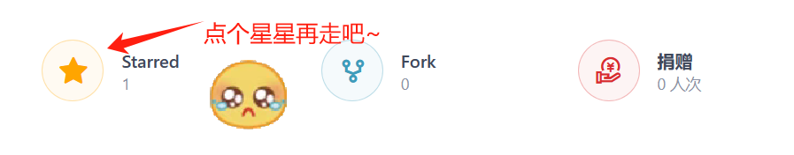

<h1 align="center"> CodeLabs </h1>

    <strong>简体中文</strong> | <a href="readme_en.md">English</a>

    
    
    

    
    
    
    
    

------------------------------------------

    开源杂货铺，包括一个程序猿（我自己）成长所需要具备的必备技能和技巧（部分）。本项目由大一下时创建，持续维护中；<b>仓库取名灵感来自于学习鸿蒙时的华为开发者Codelabs。目的为记录开发过程中一些不负责但难以记忆，在网上难以检索但非常重要的操作</b>。这也很符合CodeLab的定义：“自己动手，分享知识”。 CodeLabs静态站点已经部署，你可以访问<em>(https://dancehole.gitee.io/code-labs)</em>获得更加好的排版体验
    

-------------------------------------------------------

## 一、仓库介绍

欢迎访问CodeLabs文档仓库，参与该开源项目，与我们一起完善开发者文档。

CodeLabs包含常用非专业知识，包含Git、Markdown协作、window技巧和杂项类目等。[点击这里查看文章目录](#Catalogue)

------

**仓库动态**

-请在html中渲染-

最后更新：2024/02/29 部署gitee page并重写readme。

---------

**CodeLabs页面已经发布，你可以：**

- [点击这里](https://dancehole.gitee.io/code-labs)访问CodeLabs**最新页面**，获得良好的观览体验
- [点击这里](https://dancehole.gitee.io/code-labs)访问CodeLabs源仓库，如果喜欢就给个star吧~

## 二、文档目录

- [ ] **【目标自动维护目录】todo~**

1. 如何编写readme/文档/说明类文件：

2. 常用外设及传感器使用原理与教程

   [常用外设、传感器 · dancehole/CodeLabs - 码云 - 开源中国 (gitee.com)](https://gitee.com/dancehole/code-labs/tree/master/常用外设、传感器)

3. Git教程

总体进度：

| 目录                                   | 文件   | 解释                     | 完成情况         |
| -------------------------------------- | ------ | ------------------------ | ---------------- |
| [常用外设、传感器](./常用外设、传感器) |        | 外设学习及详细文档       | 部分完成【–>>>】 |
| [Git](./Git)                           |        | Git全阶段教程            |                  |
| [Markdown](./Markdown)                 |        | Markdown全阶段教程       |                  |
| [PublishedArticle](./PublishedArticle) |        | 已发布文章的备份         |                  |
| [SoftwareUsage](./SoftwareUsage)       | 多文件 | 各大软件的安装、使用指南 | 部分完成【–>>>】 |
| [UniversityStudy](.\UniversityStudy)   |        | 大学学习                 |                  |
| [UsefulCommands](./UsefulCommands)     |        |                          |                  |
| [utils](./utils)                       |        |                          |                  |
| [WindowsOS](./WindowsOS)               |        |                          |                  |

## 三、加入我们

欢迎您参与贡献，我们鼓励开发者以各种方式参与文档反馈和贡献。

您可以对现有文档进行评价、简单更改、反馈文档质量问题、贡献您的原创内容，详细请参考[贡献文档]()。

## 四、联系方式

网站：[dancehole 的博客](https://dancehole.gitee.io)

邮箱：1391755954@qq.com

