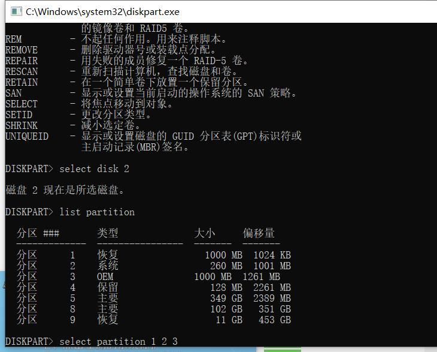
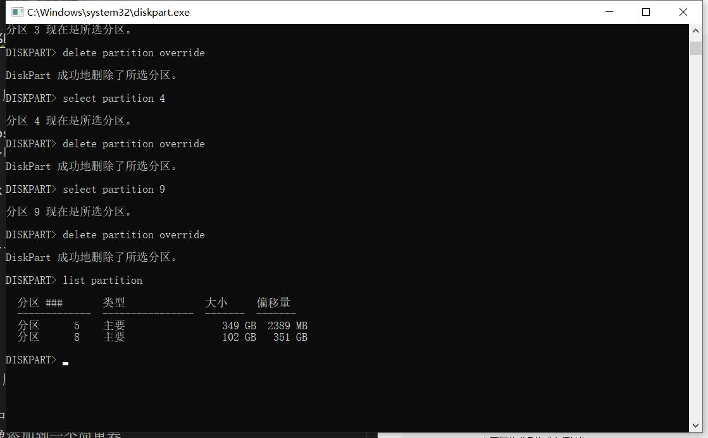
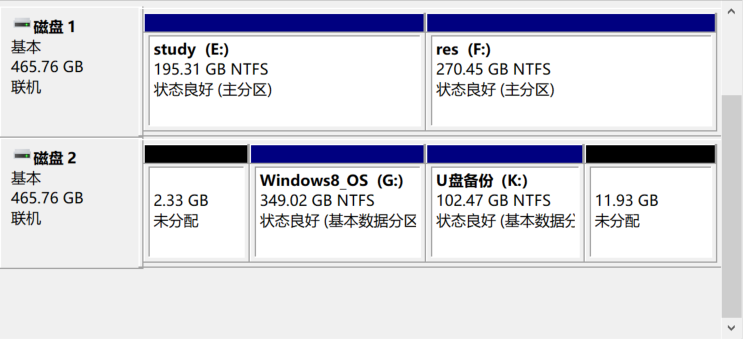

# Windows磁盘管理：删除不需要的分区（恢复分区等）
主要适用于装了系统的磁盘，格式化不会删除已有的分区表

1. 在cmd里输入 diskpart，进入磁盘管理命令行界面

我们准备一个安装了系统的磁盘（固态or机械），里面有不可删除的分区（恢复分区，等），我们需要通过此方法删除

目的：把这些分区删除，然后归为己有





1. 输入`list disk`并按Enter键。 出现物理驱动器列表。如果你在笔记本电脑上这样做，你可能只有一个驱动器。
2. `select disk 0`键入选择磁盘和磁盘的编号。第一个（或唯一）磁盘是数字0.点击Enter。
3. 键入列表分区，出现分区列表。`list partition`
4. 输入选择分区以及要删除的恢复分区的编号，可能有不止一个。`select partition 0`
5. 键入删除分区覆盖。`delete partition override`

命令行结果如下：

```
Microsoft DiskPart 版本 10.0.19041.964

Copyright (C) Microsoft Corporation.
在计算机上: DESKTOP-FFGBPDA

DISKPART> list disk

  磁盘 ###  状态           大小     可用     Dyn  Gpt
  --------  -------------  -------  -------  ---  ---
  磁盘 0    联机              476 GB  2048 KB        *
  磁盘 1    联机              465 GB  1024 KB
  磁盘 2    联机              465 GB  2048 KB        *

DISKPART> 2

Microsoft DiskPart 版本 10.0.19041.964

ACTIVE      - 将选中的分区标记为活动的分区。
ADD         - 将镜像添加到一个简单卷。
ASSIGN      - 给所选卷分配一个驱动器号或装载点。
ATTRIBUTES  - 操纵卷或磁盘属性。
ATTACH      - 连接虚拟磁盘文件。
AUTOMOUNT   - 启用和禁用基本卷的自动装载。
BREAK       - 中断镜像集。
CLEAN       - 从磁盘清除配置信息或所有信息。
COMPACT     - 尝试减少文件的物理大小。
CONVERT     - 在不同的磁盘格式之间转换。
CREATE      - 创建卷、分区或虚拟磁盘。
DELETE      - 删除对象。
DETAIL      - 提供对象详细信息。
DETACH      - 分离虚拟磁盘文件。
EXIT        - 退出 DiskPart。
EXTEND      - 扩展卷。
EXPAND      - 扩展虚拟磁盘上可用的最大大小。
FILESYSTEMS - 显示卷上当前和支持的文件系统
FORMAT      - 格式化卷或分区
GPT         - 给选择的 GPT 分区分配属性。
HELP        - 显示命令列表。
IMPORT      - 导入磁盘组。
INACTIVE    - 将所选分区标为不活动。
LIST        - 显示对象列表。
MERGE       - 将子磁盘与其父磁盘合并。
ONLINE      - 使当前标为脱机的对象联机。
OFFLINE     - 使当前标记为联机的对象脱机。
RECOVER     - 刷新所选包中所有磁盘的状态。
              尝试恢复无效包中的磁盘，并
              重新同步具有过时丛或奇偶校验数据
              的镜像卷和 RAID5 卷。
REM         - 不起任何作用。用来注释脚本。
REMOVE      - 删除驱动器号或装载点分配。
REPAIR      - 用失败的成员修复一个 RAID-5 卷。
RESCAN      - 重新扫描计算机，查找磁盘和卷。
RETAIN      - 在一个简单卷下放置一个保留分区。
SAN         - 显示或设置当前启动的操作系统的 SAN 策略。
SELECT      - 将焦点移动到对象。
SETID       - 更改分区类型。
SHRINK      - 减小选定卷。
UNIQUEID    - 显示或设置磁盘的 GUID 分区表(GPT)标识符或
              主启动记录(MBR)签名。

DISKPART> select disk 2

磁盘 2 现在是所选磁盘。

DISKPART> list partition

  分区 ###       类型              大小     偏移量
  -------------  ----------------  -------  -------
  分区      1    恢复                1000 MB  1024 KB
  分区      2    系统                 260 MB  1001 MB
  分区      3    OEM               1000 MB  1261 MB
  分区      4    保留                 128 MB  2261 MB
  分区      5    主要                 349 GB  2389 MB
  分区      8    主要                 102 GB   351 GB
  分区      9    恢复                  11 GB   453 GB

DISKPART> select partition 1 2 3 4 9

为此命令指定的参数无效。
有关此命令类型的详细信息，请使用 HELP SELECT PARTITION 命令

没有选择分区。

DISKPART> select partition 1

分区 1 现在是所选分区。

DISKPART> delete partition override

DiskPart 成功地删除了所选分区。

DISKPART> select partition 2

分区 2 现在是所选分区。

DISKPART> delete partition override

DiskPart 成功地删除了所选分区。

DISKPART> select partition 3

分区 3 现在是所选分区。

DISKPART> delete partition override

DiskPart 成功地删除了所选分区。

DISKPART> select partition 4

分区 4 现在是所选分区。

DISKPART> delete partition override

DiskPart 成功地删除了所选分区。

DISKPART> select partition 9

分区 9 现在是所选分区。

DISKPART> delete partition override

DiskPart 成功地删除了所选分区。

DISKPART> list partition

  分区 ###       类型              大小     偏移量
  -------------  ----------------  -------  -------
  分区      5    主要                 349 GB  2389 MB
  分区      8    主要                 102 GB   351 GB

DISKPART>
```

我们打开计算机管理，可以看到分区被释放，变成【未分配】分区，然后就可以愉快的扩展/分配驱动器 


后续补充：我们还可以使用disk genius 简单的管理分区，实现上述功能