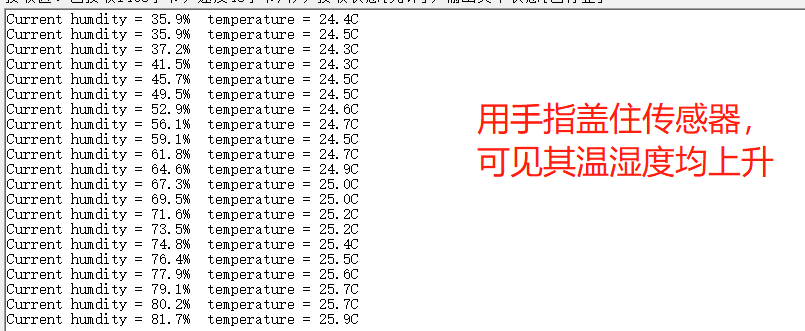

# 快速上手
接线：
数字信号接模拟输入A0
Arduino示例代码：
```arduino
xxxxxxxxxx98 1#define dht_dpin A0   // 设定A0为模拟输入接口(a0-a5)2byte bGlobalErr;3byte dht_dat[5];45void setup(){6InitDHT();7Serial.begin(9600);8delay(300);9Serial.println("Humidity and temperature\n\n");10delay(700);11}1213void loop(){14  ReadDHT();15  switch (bGlobalErr){      //获取数据后，开始打印16     case 0:17 Serial.print("Current humdity = ");18 Serial.print(dht_dat[0], DEC);19 Serial.print(".");20 Serial.print(dht_dat[1], DEC);21 Serial.print("%  ");22 Serial.print("temperature = ");23 Serial.print(dht_dat[2], DEC);24 Serial.print(".");25 Serial.print(dht_dat[3], DEC);26 Serial.println("C  ");27        break;28     case 1:29        Serial.println("Error 1: DHT start condition 1 not met.");30        break;31     case 2:32        Serial.println("Error 2: DHT start condition 2 not met.");33        break;34     case 3:35        Serial.println("Error 3: DHT checksum error.");36        break;37     default:38        Serial.println("Error: Unrecognized code encountered.");39        break;40      }41  delay(800);42}4344void InitDHT(){45   pinMode(dht_dpin,OUTPUT);46        digitalWrite(dht_dpin,HIGH);47}4849void ReadDHT(){50bGlobalErr=0;51byte dht_in;52byte i;53digitalWrite(dht_dpin,LOW);54delay(20);5556digitalWrite(dht_dpin,HIGH);57delayMicroseconds(40);58pinMode(dht_dpin,INPUT);59//delayMicroseconds(40);60dht_in=digitalRead(dht_dpin);6162if(dht_in){63   bGlobalErr=1;64   return;65   }66delayMicroseconds(80);67dht_in=digitalRead(dht_dpin);6869if(!dht_in){70   bGlobalErr=2;71   return;72   }73delayMicroseconds(80);74for (i=0; i<5; i++)75   dht_dat[i] = read_dht_dat();76pinMode(dht_dpin,OUTPUT);77digitalWrite(dht_dpin,HIGH);78byte dht_check_sum =79       dht_dat[0]+dht_dat[1]+dht_dat[2]+dht_dat[3];80if(dht_dat[4]!= dht_check_sum)81   {bGlobalErr=3;}82};8384byte read_dht_dat(){85  byte i = 0;86  byte result=0;87  for(i=0; i< 8; i++){88      while(digitalRead(dht_dpin)==LOW);89      delayMicroseconds(30);90      if (digitalRead(dht_dpin)==HIGH)91     result |=(1<<(7-i));92    while (digitalRead(dht_dpin)==HIGH);93    }94  return result;95}969798
```

