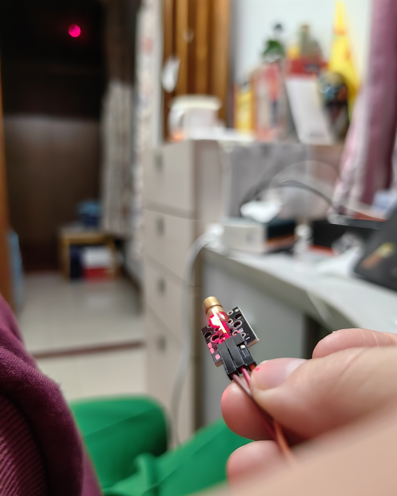

# 合集内容:信号灯控制类
- 双色灯x2
- 3色LED
- 3色RGB
- 激光发射器
- 


前言：灯控，一般只用到led，其他都是{装逼}，这些灯原理和使用方法都相似，故放到一起

# 双色灯（两个-大小灯-红绿灯） 
型号：GR-
参数
```
*************************************
发光颜色：绿色+红色
直　　径：3mm
封装颜色：无
封装类型：扩散
使用电压(V)：2.0-2.5
使用电流(MA)：10
发光角度：150
波长(NM)：571+644
发光强度(MCD)：20-40；40-80
支架类型：长脚
产品广泛应用于电子词典、PDA、MP3、耳机、数码相机、VCD、DVD、汽车音响、通讯、计算机、充电器、功放、仪器仪表、礼品、电子玩具及移动电话等诸多领域。
******************************************

```
原始测试程序:灯光闪烁-从红到黄
```arduino
 //Arduino test code:
int redpin = 11;    // select the pin for the red LED
int bluepin =10;    // select the pin for the blueLED
int val;

void setup() {
  pinMode(redpin, OUTPUT);
  pinMode(bluepin, OUTPUT);
  Serial.begin(9600);
}

void loop() 
{
for(val=255; val>0; val--)
  {
   analogWrite(11, val);
   analogWrite(10, 255-val);
   delay(15); 
  }
for(val=0; val<255; val++)
  {
   analogWrite(11, val);
   analogWrite(10, 255-val);
   delay(15); 
  }
 Serial.println(val, DEC);
}


```

小问题：为什么 红绿双色，显示不了绿色呢？

我们进行一个测试：进行数电平输出
```arduino
int LED = 11; // LED引脚对应10（red）或者11（green）

void setup () {
   pinMode(LED, OUTPUT); // set the digital pin as output
}

void loop() { 
   digitalWrite(LED,HIGH); // turn on led
   delay(500); // delay for 500 ms
   digitalWrite(LED,LOW); // turn off led
   delay(500); // delay for 500 ms
}
```
接线：G（green） - 数字引脚10（arduino为~10,即支持pwn输入）
red高电平为红色，green高电平为黄色，两个同时输入为

？？？

# 其他外设：

## 激光发射器
本质就是io的驱动，代码如下：
```arduino
void setup() 
{                
 pinMode(13, OUTPUT);  //   定义13脚为数字输出接口
}

void loop() {
  digitalWrite(13, HIGH);   // 打开激光头
  delay(1000);              // 延时一秒
  digitalWrite(13, LOW);    // 关闭激光头
  delay(1000);              // 延时一秒
}
```
非常简单。

下面介绍pwn驱动grb灯：

一、概述：
RGB LED模块由一个贴片全彩LED制成，通过R、G、B三个引脚的PWM电压输入可以调节三种基色（红/蓝/绿）的强度从而实现全彩的混色效果。用Arduino对模块的控制可实现酷炫的灯光效果。
二、产品参数：
产品特性：
1，使用5050全彩LED
2，RGB三基色接限流电阻防止烧坏
3，通过PWM调节三基色可混合得到不同的颜色
4，可与各种单片机接口
5.工作电压：5V
6.LED驱动模式：共阴驱动
三、Arduino test code：

```arduino
int redpin = 11; //select the pin for the red LED
int bluepin =10; // select the pin for the  blue LED
int greenpin =9;// select the pin for the green LED

int val;

void setup() {
  pinMode(redpin, OUTPUT);
  pinMode(bluepin, OUTPUT);
  pinMode(greenpin, OUTPUT);
  Serial.begin(9600);
}

void loop() 
{
for(val=255; val>0; val--)
  {
   analogWrite(11, val);
   analogWrite(10, 255-val);
   analogWrite(9, 128-val);
   delay(1); 
  }
for(val=0; val<255; val++)
  {
   analogWrite(11, val);
   analogWrite(10, 255-val);
   analogWrite(9, 128-val);
   delay(1); 
  }
 Serial.println(val, DEC);
```

## 激光发射器
```arduino
void setup() 
{ 
pinMode(13, OUTPUT); // 定义13脚为数字输出接口
}
void loop() {
 digitalWrite(13, HIGH); // 打开激光头
 delay(1000); // 延时一秒
 digitalWrite(13, LOW); // 关闭激光头
http://keyes-arduino.taobao.com
 delay(1000); // 延时一秒
}
```
和LED 发光 相同


无相关原理

接线：
```
- -> -
s -> pinx （信号）
中间 -> +
```

效果展示：

